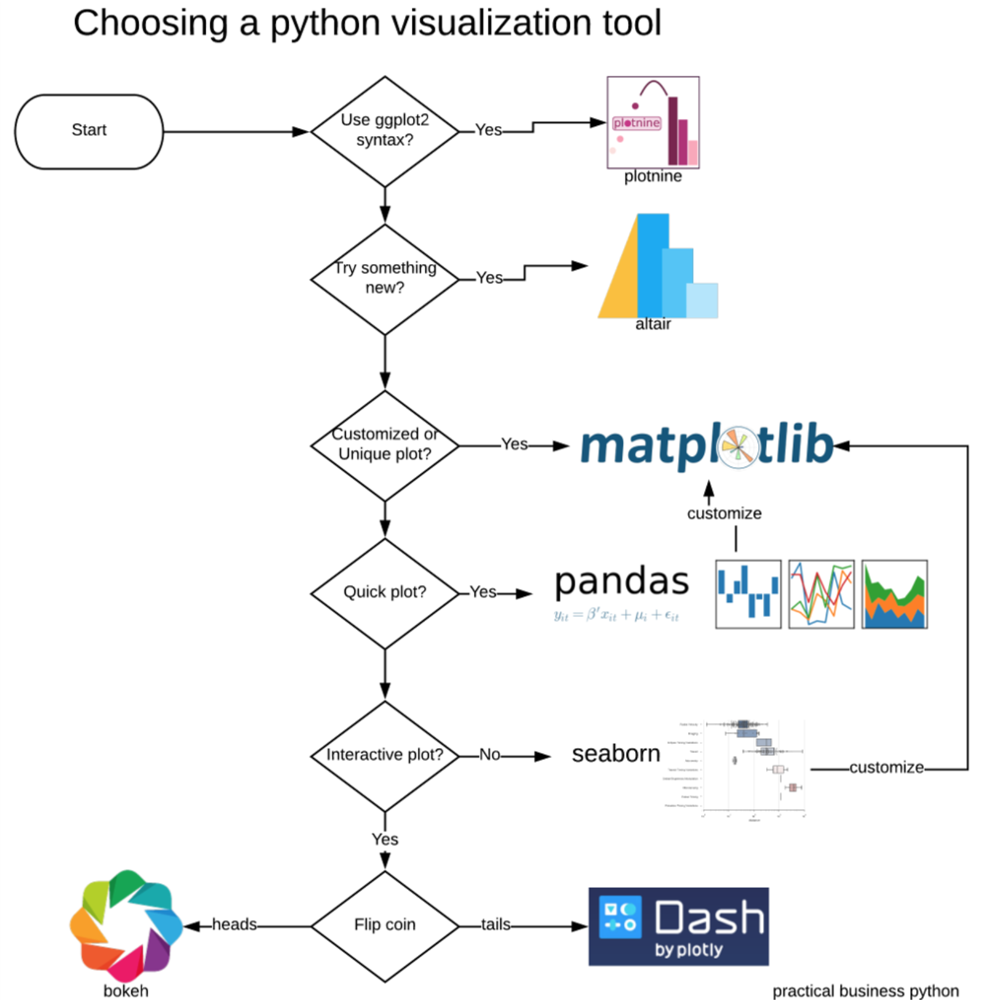

## Python data visualization libraries

Here is a list of popular high level visualization libraries in Python, and blogs that compares them.

* [altair](https://altair-viz.github.io/)
   * Has a nice logic of plotting. Each part of the figure is treated as an object. A figure can be created by summing up those object. 
   * [Interactive plots](https://altair-viz.github.io/gallery/index.html#interactive-charts) are easy to create.
   * Implemented by Pthon, outputs JSON, rendered by Javascript
  

* [bokeh](https://bokeh.pydata.org/en/latest/) 
   * possible to create detailed impressive graphs.
   * relatively more difficult to understand than **altair**
   * Sponsored by [NumFocus](https://numfocus.org/)
   * Easy to use example: [selection_histogram](https://bokeh.pydata.org/en/latest/docs/gallery.html)
   * Implemented by Pthon, outputs JSON, rendered by Javascript

* [plotly](https://plot.ly/python/)
   * more professional compare to previous two
   * [3D plots](https://plot.ly/python/3d-scatter-plots/) are impressive
   * compatible with R as well

* [seaborn](https://seaborn.pydata.org/)
   * I was using this frequently before, but gave up. Not very flexible.
   

### Comparisons

* https://twitter.com/jakevdp/status/975105808861032448?lang=en
* http://pbpython.com/python-vis-flowchart.html

